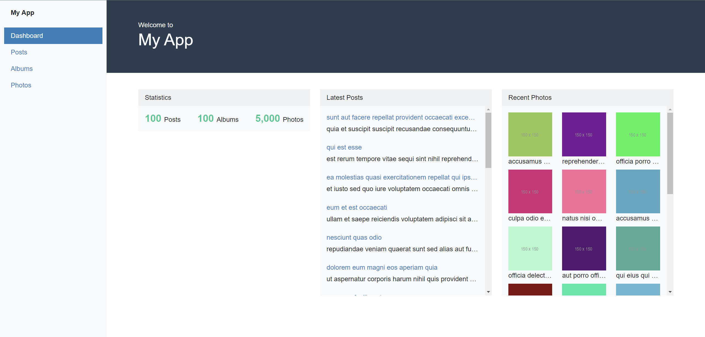
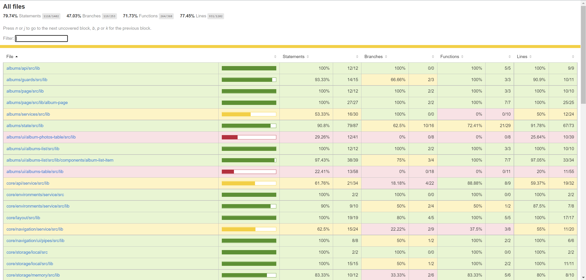

# ZiphrTask

A simple dashboard built with Angular 14, Nx workspace, ngrx, Bootstrap 5 and ng-bootstrap.

## Working application

Check out the **live application** -> https://json-placeholder-dashboard.netlify.app/

## Tech stack

- [Angular 14][angular]
- [Nx Workspace][nx]
- [ngrx][ngrx] and
- [ng-bootstrap][ng-bootstrap] UI component: `offcanvas`, `pagination`, `breadcrumb`, `select` and more.
- [Bootsrap 5][bootsrap] - For basic components styles and utilities
- [Netlify][netlify] for deployment
- [Yarn][yarn] package manager is used

[angular]: https://angular.io/
[ngrx]: https://ngrx.io/
[nx]: https://nx.dev/
[bootsrap]: https://getbootstrap.com/
[ng-bootstrap]: https://ng-bootstrap.github.io/
[netlify]: http://netlify.com/
[yarn]: https://yarnpkg.com/

## High-level design

All components are following:

- OnPush Change Detection and async pipes: all components use observable and async pipe for rendering data without any single manual subscribe. Only some places are calling subscribe for reacting to route params and form value changes.
- SCAMs (single component Angular modules) for tree-shakable components, meaning each component will have a respective module. For example, a LogoComponent will have a corresponding LogoModule.
- Mostly, everything stay in the `libs` folder. Modules, Configurations, Components etc... are in libs. libs should be separated into different directories based on features. We won't put them inside the apps folder. For example in an Angular, contains the `main.ts`, `app.component.ts` and `app.module.ts`

## Development server

Run `yarn run start` for a dev server. Navigate to http://localhost:4545/. The app will automatically reload if you change any of the source files.

## Build

Run `yarn run build` to build the project. The build artifacts will be stored in the `dist/` directory.

## Testing 

Run `nx test-all-libs` to execute the unit tests of all libs.

Run `nx test-coverage-report` to execute the unit tests of all libs and get coverage report.

Run `nx affected:test` to execute the unit tests affected by a change.

Unit tests have been written using jest, jasmine-marbles, ts-mockito(for mocking instances) tools.

### Coverage percentage:

### Untested libs (no custom tests have been written):
- [albums-services][albums-services]
- [albums-ui-album-photos-table][albums-ui-album-photos-table]
- [albums-ui-albums-table][albums-ui-albums-table]
- [core-store-root][core-store-root]
- [core-table-service][core-table-service]
- [core-utils-table-extensions][core-utils-table-extensions]
- [photos-services][photos-services]
- [photos-ui-photos-table][photos-ui-photos-table]
- [posts-services][posts-services]
- [posts-ui-posts-table][posts-ui-posts-table]
- [ui-breadcrumb][ui-breadcrumb]
- [ui-paginator][ui-paginator]
- [ui-sort-icon][ui-sort-icon]

[albums-services]:https://github.com/AkbarKarshiev/ziphr-task/tree/main/libs/albums/services
[albums-ui-album-photos-table]:https://github.com/AkbarKarshiev/ziphr-task/tree/main/libs/albums/ui/album-photos-table
[albums-ui-albums-table]:https://github.com/AkbarKarshiev/ziphr-task/tree/main/libs/albums/ui/albums-table
[core-store-root]:https://github.com/AkbarKarshiev/ziphr-task/tree/main/libs/core/store/root
[core-table-service]:https://github.com/AkbarKarshiev/ziphr-task/tree/main/libs/core/table/service
[core-utils-table-extensions]:https://github.com/AkbarKarshiev/ziphr-task/tree/main/libs/core/utils/table-extensions
[photos-services]:https://github.com/AkbarKarshiev/ziphr-task/tree/main/libs/photos/services
[photos-ui-photos-table]:https://github.com/AkbarKarshiev/ziphr-task/tree/main/libs/photos/ui/photos-table
[posts-services]:https://github.com/AkbarKarshiev/ziphr-task/tree/main/libs/posts/services
[posts-ui-posts-table]:https://github.com/AkbarKarshiev/ziphr-task/tree/main/libs/posts/ui/posts-table
[ui-breadcrumb]:https://github.com/AkbarKarshiev/ziphr-task/tree/main/libs/ui/breadcrumb
[ui-paginator]:https://github.com/AkbarKarshiev/ziphr-task/tree/main/libs/ui/paginator
[ui-sort-icon]:https://github.com/AkbarKarshiev/ziphr-task/tree/main/libs/ui/sort-icon

## Dependency Graph

Run `nx graph` to see a diagram of the dependencies of projects.

